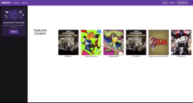
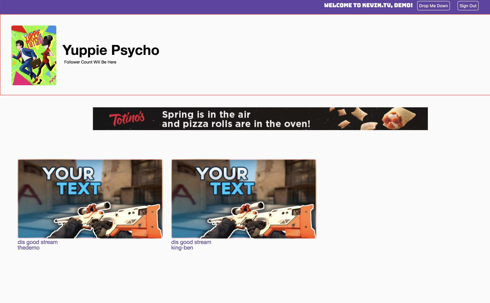
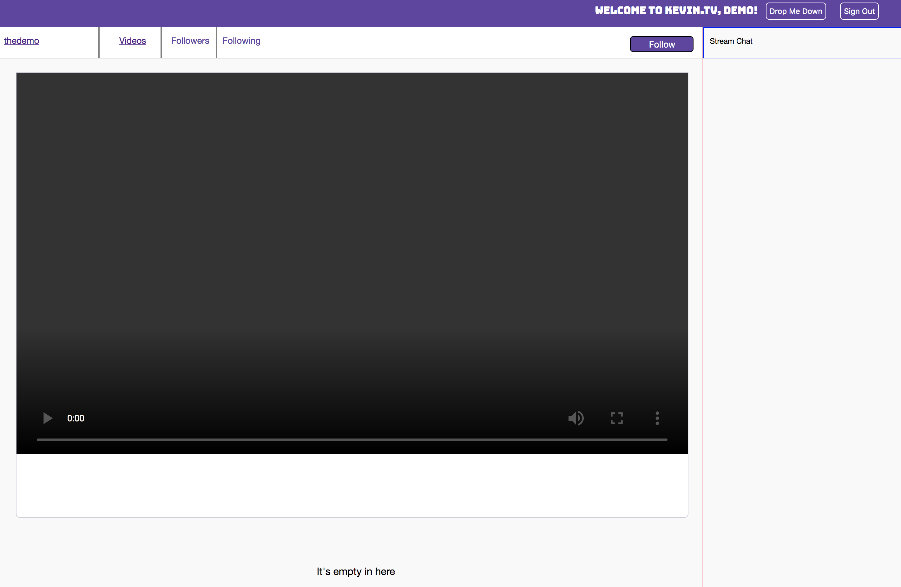
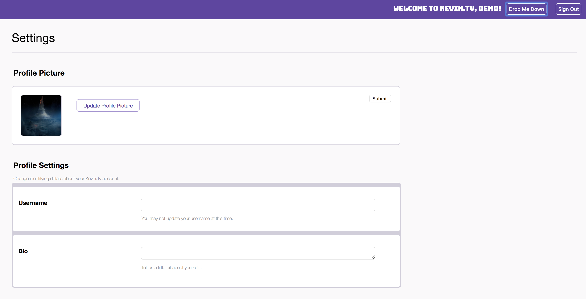

# Kevin.Tv
An homage to the days of Justin.tv, Kevin.Tv is a clone of the popular online streaming platform Twitch.tv. Built over the course of two weeks, the project leverages Ruby on Rails to build out the backend web API, while taking advantage of React/Redux to create the frontend components.

## User Login/Signup
Login and signup are handled through an interactive modal, which is only accessible when a user is not currently logged in. There is a route to this modal for a logged out user in both the navigation bar, as well as the left hand bar.

There is a default demo user account that users can use to browse the site if they do not wish to signup themselves. See a short demo of the signup experience below.

## Games & Streamers Directories
Once logged in, users can browse games that currently have live streams, and from there, explore the streamers that are currently playing those games and click onto their channel.

## User Profiles and Avatar Upload
Each user has access to a personal profile page where they can add an avatar. Accessible from the drop-down menu in the navigation bar, users cannot edit one another's profiles, a precaution ensured by implementing Auth Routes with React Router.

You can see from the screenshot below, that Username and Bio editing is a feature that is currently in the works. This section will be expanded when it is live.

## Video Upload, Edit, and Deletion
Users are able to access and browse all videos that have been uploaded by all other streamers. However, users can only perform CRUD operations on videos that they themselves have uploaded.

Users will also be allowed to edit their stream title and what game they are playing from their channel page. This edit button is currently in place, but will only appear when a user is viewing their own channel.

## What does the future hold?
Over the next couple of weeks, the goal of Kevin.Tv is to complete deployment to a production environment, and to finish implementing full CRUD functionality for the user video portion of the page.

Immediately after that, Following will be implemented, with live chat being the final MVP for this project.